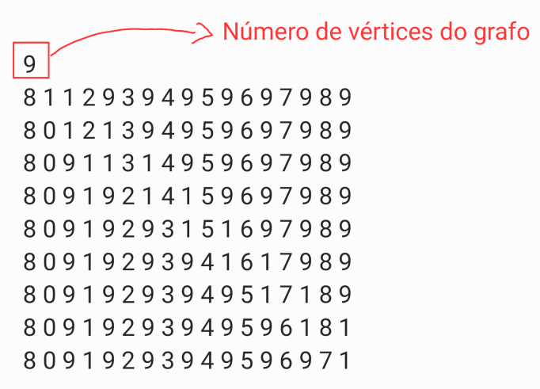

<h1 align="center">Algoritmo de Floyd-Warshall</h1>
<h2>Introdução</h2>
 

Na ciência da computação, o algoritmo de Floyd-Warshall é um algoritmo que resolve o problema de calcular o caminho mais curto entre todos os pares de vértices em um grafo orientado (com direção) e valorado (com peso). O algoritmo escrito em C++ é um bom exemplo de programação dinâmica.

 Exemplo: Suponha um grafo com 3 vértices(A,B,C) e 3 arestas, cujos os pesos são: AB = 1; AC = 9; BC = 1

 

    

A melhor rota partindo de A e com destino a C não é necessariamente a que liga os vértices A e C diretamente e sim aquela que passa pelo vértice B. O caminho A->B->C tem custo: 2 e o caminho A->C tem custo: 9.

<h2>Inputs</h2>
<ul>

<li>

No repositório disponibilizado há um arquivo chamado <i>Entradas.txt</i> com os seguintes inputs: 

    

</li>

<li>

A primeira linha representa o número de vétices total do grafo.

    

</li>

<li>

A primeira coluna indica o grau de cada vértice. Considere que cada vértice é representado pelo índice (i) da linha em que se encontra. Logo cada linha com exceção da primeira representa um vértice.

    

</li>

<li>

As demais colunas são lidas em pares indicam respectivamente as arestas e seus respectivos pesos.

    

</li>

</ul>

 
<h2>Código</h2>
<h3>Estrutura básica dos grafos</h3>

As structs <i>Aresta, Vertice e Grafo</i> representam a estrutura básica de um grafo com Lista de Adjacência. Para estrutura de Lista foi utilizado a biblioteca <i>#include < list > .</i>

~~~C++
typedef struct Aresta{
        int viz;    //Vizinho
        float peso; //Peso da aresta
    }Aresta;

    typedef struct Vertice{
        int grau;
        list<Aresta> adj; //Lista de adjacência
    }Vertice;

    typedef struct Grafo{
        int NV; //Número de Vértices
        int NA; //Número de Arestas
        Vertice* V;
    }Grafo;
~~~

 
<h3>Funções</h3>
<h4>Criação do Grafo - CreateGrafo(Grafo& G) </h4>

Essa função tem como objetivo ler os dados do arquivo de input (Entrada.txt) e montar um grafo orientado. As informações lidas referentes as arestas de incidentes são devidamente setadas nas listas de adjacência de cada vértice.

~~~C++
int CreateGrafo(Grafo& G){
        Aresta A;
        ifstream arq;
        
        arq.open("Entradas.txt");               //Abrindo o arquivo de entrada
        
        if(arq.fail()) return 0;                //Verificando erros na abertura

        arq >> G.NV;                            //Atribui o Número de vértices do grafo
        G.NA = 0;                               //Iguala o número de arestas igual a 0,
                                                //pois depois todas as arestas serão tratadas 
                                                //separadamente
        G.V = NULL;       
        G.V = new Vertice[G.NV];                 // Atribuindo os vétices do grafo

        for(int i = 0; i < G.NV; i++){          
            int grau;
            arq >> grau;
            G.V[i].grau = grau;                 //Atribuindo o valor lido no arquivo 
                                                //para a estrutura do Grafo
            G.NA += grau;                       //O núemro de arestas de um grafo é 
                                                //igual a soma de todas as arestas incidentes 
                                                //dos vétices desse grafo
            
            for(int j = 0; j < grau; j++){      //Caminhar nas Colunas do arquivo
                int viz;
                float peso;                     //Ler cada aresta e seu respetivo peso.
                                            
                arq >> viz;                     
                arq >> peso;

                A.viz = viz;
                A.peso = peso;
                G.V[i].adj.push_back(A);   //criar a lista de ajacencia de cada 
                                        //vétice, o comando push_back adiciona itens na lista
            }

        }

        arq.close();
        return 1;
    }
~~~
 
<h4>Exibição de matriz -  void printMatriz(float** matriz, int m, int n)</h4>

Função genérica para exibição de uma matriz:

~~~C++
 void printMatriz(float** matriz, int m, int n){
        cout<<"\n"<<endl;
        for(int i = 0; i < m; i++){
            for(int j = 0; j < n; j++){
                if(matriz[i][j] < DBL_MAX) cout<<matriz[i][j]<<"    ";
                else cout<<"if  ";
            }
            cout<<"\n";
        }
    }
~~~

 
<h3>Algoritimo de Floyd</h3>
 
<h4>void Floyd(Grafo G, float** dist, int** pi)</h4>

Essa função recebe como parâmetro duas matrizes "dist" e "pi". A matriz "dist" representa os custos para ir de um a vértice ao outro, sendo: a linha o vértice de origem(i) e a coluna o vérice de destino(j). Enquanto, a matriz "pi" representa a melhor rota entre o vértice de origem(i) e seu destino(j).

Inicialmente a função seta valores default para as matrizes, "dist" recebe DBL_MAX para todas as posições[i][j], o valor "DBL_MAX" representa infinito, valor usado para indicar quando dois vértices não tem conexão. Enquanto isso a matriz: "pi" recebe o valor: "-1" que indica a que os dois vértices possuem a melhor rota entre eles.

O programa acessa a lista de ajacência dos vertices[i] e atualiza as posições necessárias na matriz "dist", dessa forma obtem-se: as aretas incidentes[j] e seus pesos.

Por fim a função calcula as menores rotas entre dois pares de vértices.Para isso, o algoritmo segue o princípio da otimilidade de Belman, utilizando um vértice K como um vértice intermediário entre a origem[i] e o destino[j]. Se a soma do custo de i até K e de K até J for menor que o custo de i até j, então o melhor caminho não é aquele que liga i e j diretamente e sim aquele que passa por K.

Após esse processo o valor de K é salvo na matriz "pi" na posição pi[i][j], e a matriz "dist" também é atualizada com o novo custo entre i e j.

~~~C++
void Floyd(Grafo G, float** dist, int** pi){
        list<Aresta>::iterator it;       //lista auxiliar 
        int j = 0;                       //Variável auxiliar   

        int N = G.NV;
        for(int i = 0; i < N; i++){      //setar valores default 
            for(int j = 0; j < N; j++){
                dist[i][j] = DBL_MAX;    //DBL_MAX significa infinito. 
                pi[i][j] = -1;
            }
            dist[i][i] = 0;             //A distância de um vértice até ele mesmo é 0
        }

        for(int i = 0; i < N; i++)      //Acesso aos valores da lista de adj para 
                                        //matriz de "dist".As posiçôes representam o peso.
            for(it = G.V[i].adj.begin(); it != G.V[i].adj.end(); ++it){
                j = (*it).viz;                  
                dist[i][j] = (*it).peso;
            }
        
        for(int k = 0; k < N; k++){             //Nessa parte analisamos a ditância entre um ponto intermediario entre i e j 
            for(int i = 0; i < N; i++)
                for(int j = 0; j < N; j++)
                    if(dist[i][j] > dist[i][k]+dist[k][j]){
                        dist[i][j] = dist[i][k] + dist[k][j];
                        pi[i][j] = k;
                    }
        }

    }
~~~

 
<h4>MenorCaminho(float** dist, int** pi, int i, int j) - MenorCaminhoR(float** dist, float *custo,int** pi, int i, int j)</h4>

Essa função acessa os valores salvos na matriz "pi" para encontrar a melhor rota entre um par de vértices. A função <i>MenorCaminhoR</i> é recursiva e caminha de um vértice para o outro se o valor que representa a rota for "-1".

~~~C++
    void MenorCaminho(float** dist, int** pi, int i, int j){
        float x = 0;
        float *custo = &x;

        cout<< "\nMelhor caminho entre [" << i << "] e [" << j << "]: " <<i << " ";
        MenorCaminhoR(dist,custo,pi,i,j);
        cout<< "        Custo: " << *custo ;
    }
    void MenorCaminhoR(float** dist, float *custo,int** pi, int i, int j) {
        if (pi[i][j] == -1) {
            *custo += dist[i][j];
            cout<<j;
            return;
        }
        MenorCaminhoR(dist,custo,pi,i,pi[i][j]);
        cout<<" ";
        MenorCaminhoR(dist,custo,pi,pi[i][j],j);
    }
~~~

 
<h2>Compilação e execução</h2>

A compilação do algoritmo tem como objetivo mostrar o funcionamento das funções acima mencionadas. Inicialmente é exibida a Matriz de custos dos vértices de origem [i ->linha] ao destino [j ->coluna].

    

A segunda parte exibe cada vértice e todos os menores caminhos entre todos os pares, como na imagem a seguir , com o vértice de índice 0.

    

<h3>Código de Compilação</h3>

A compilação é realizada pelo compilador g++ com a seguinte linha de comando:

 

~~~C
g++ Floyd.cpp -o executavel -Wall
~~~